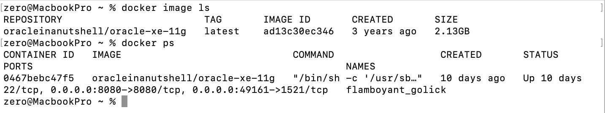
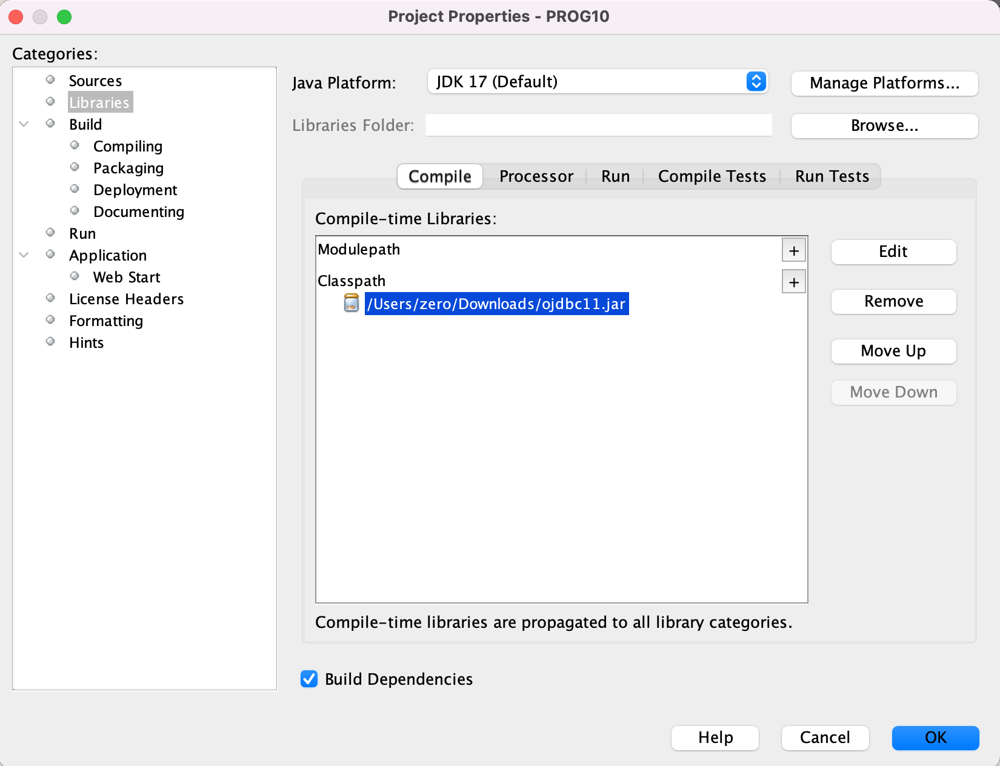
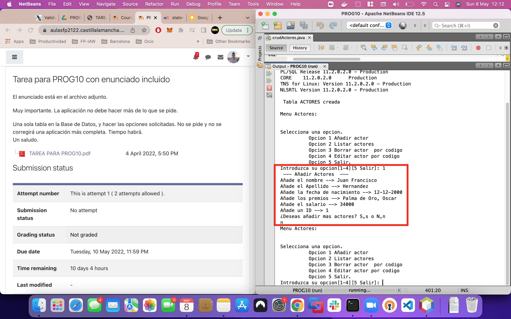
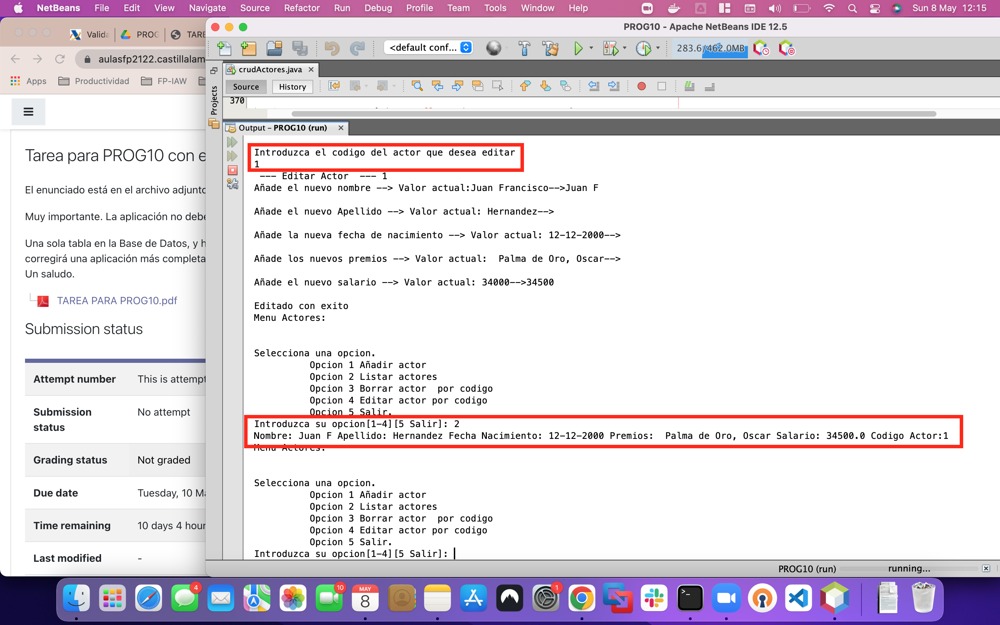
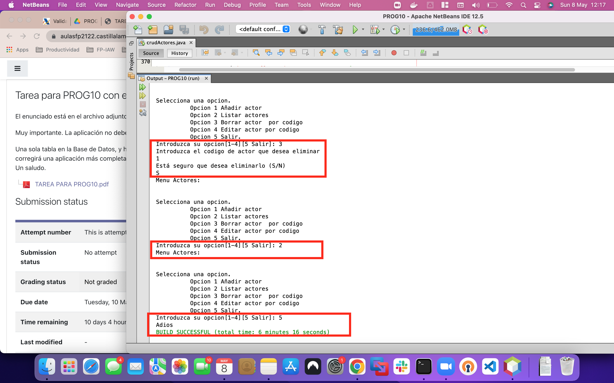

# Prog10 

### Requerimientos

* Instalacion de Docker
* Instalacion de SGBD Oracle 11g Express.
* Integracion de fichero .jar en el proyecto para la conexion entre JDE y SGDB

##### Instalacion de Docker
* Intrucciones a seguir: https://docs.docker.com/engine/install/
##### Instalacion SGDB
1. Hacemos login en docker / Crear cuenta si no.

```bash
> docker login 
        user: user
        pass: secret
```
2. Descargamos la imagen
```bash
> docker pull docker pull oracleinanutshell/oracle-xe-11g   
```
3. Corremos la imagen
```bash
> docker run -d -p 49161:1521 -p 8080:8080 oracleinanutshell/oracle-xe-11g
```
###### Resultado

Mas info:
>Imagen DockerHub https://hub.docker.com/r/oracleinanutshell/oracle-xe-11g

##### JAR de conexion para la BD
1. Descargamos el Jar de conexion compatible con nuestro JDE para `Oracle` con el nombre `ojdbc11.jar` https://www.codejava.net/java-se/jdbc/jdbc-driver-library-download


2. Añadimos este archivo jar a nuestro proyecto en Netbeans.
      1. Netbean>Prog10>Project Properties
      2. Libraries>Classpath>`+`
      3. Seleccionamos el .jar descargado

###### Resultado

##### Socket de conexion
* Finalmente establecemos los parametros de conexion contra la BD desde el codigo fuente.
```java
     static Connection connection() throws ClassNotFoundException, SQLException{
                // Seteamos la conexion con la DB
                Class.forName("oracle.jdbc.OracleDriver");

                            // Parametros de conexion
                            String dbURL = "jdbc:oracle:thin:@localhost:49161:xe";
                            String user  = "system";
                            String pass  = "oracle";

                            // Objeto de conexion
                            Connection conn = null;
                            
                            // Socket de Conexion para BD
                            conn = DriverManager.getConnection(dbURL, user, pass);
                           
     
                            return conn;
     
     }
````
# Sobre este proyecto
* Levantamos una base de datos `Oracle-xe-11g` creamos una tabla llamada `Actores` sobre la que realizaremos operaciones `CRUD`

> Clases mas importantes:
> * `Connection` nos permite conectar nuestro codigo con la BD (ojdbc11.jar).
> * `Statement` nos permite preparar sentencias SQL(debemos cerrar la transaccion con el metodo close().
> * `Resultset` nos permite recopilar en una tabla el resultado de una sentencia para su posterior procesado.


> Metodos mas importantes:
> * `createStatement()` para bindear las querys contra la BD.
> * `executeUpdate()` para querys tipo DML en la BD (INSERT, UPDATE, CREATE and DELETE)
> * `executeQuery()` : para traer informacion datos de BD (SELECT).


#### Traer conexion y creamos la declaracion
> `connection()`funcion creada para todas las operaciones CRUD que devuelve  el socket de conexion.

```java
    Connection conn = connection();
    Statement stmt = conn.createStatement();

````

#### Comprobamos la conexion y los datos de la BD

```java
if (conn != null) 
            {
                System.out.println("Connected to DB \n");
            
         
               // Ejecutamos sentencia contra la BD
               ResultSet rset = stmt.executeQuery("select BANNER from SYS.V_$VERSION");
               
               
                  
                System.out.println("SQL Server info:\n");
  
                //Iteramos el resultset
                while (rset.next()){
                System.out.println (rset.getString(1));   // Print col 1
                }
             
````


#### Creamos la tabla


```java
  String sql = "CREATE TABLE APEX_040000.ACTORES "+
  "(codigo_actor INTEGER not NULL,"+
  "nombre VARCHAR(255),"+ 
  "apellido VARCHAR(255),"+
  "f_nacimiento VARCHAR(255),"+
  "premios VARCHAR(255),"+
  "salario FLOAT,"+
  "PRIMARY KEY (codigo_actor))"; 

  try
  { 
     stmt.executeUpdate(sql);
  }
  catch (SQLException ex)
  {
     System.out.println("Tabla ya creada");
  }
    
    
````

## Pruebas de ejecucion

##### Insertar un nuevo registro

##### Insertar un Editar y listar un registro

##### Eliminar, consultar y salir
